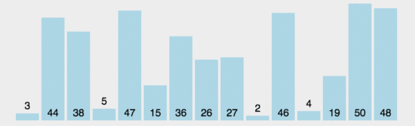

### 选择排序
分为已排序区间和未排序区间，每次从未排序区间中选择最小的元素，插入已排序区间中。当未排序区间为空，则排序完成。  

  

#### 分析
- 是否为原地排序算法
  - 是
- 是否为稳定的排序算法
  - 否
- 时间复杂度
  - 最好情况下的时间复杂度：**$O(n^2)$**
  - 最坏情况下的时间复杂度：**$O(n^2)$**
  - 平均情况下的时间复杂度：**$O(n^2)$**
